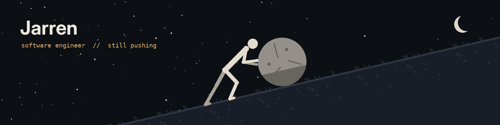

  

<h2 align="center">Hey, I'm Jarren 👋</h2>

  Software engineer in Dallas. Full-stack by trade, security-curious by training. 
  <i>One must imagine the dev happy.</i>

  
  
  

---

### 🪨 About me

- 🎓 Texas A&M, B.S. Computer Science, Emphasis in Business and Cybersecurity
- 💼 Software Engineer at Accenture
- 🔨 Building full-stack apps, automations, and AI-assisted tools on the side
- 🌱 Currently learning: DDIA
- 🏕️ Off the keyboard: lifting, combat sports

### 🛠️ Tech stack

**Languages**

**Frameworks & tools**

### 📌 Featured projects

| Project | What it does | Stack |
| --- | --- | --- |
| [Budgeting App](https://github.com/YOUR_USERNAME/REPO) | Splits each paycheck into buckets by percentage | React, TypeScript, Supabase |
| [House Finder](https://github.com/YOUR_USERNAME/REPO) | Chatbot that helps you search for a home | TypeScript, LLM APIs |
| [Air Filter Shipments](https://github.com/YOUR_USERNAME/REPO) | Shipment scheduling system for a renters insurance product | Node.js, SQLite |

### 📊 GitHub stats

  
  

  

  

---

  

